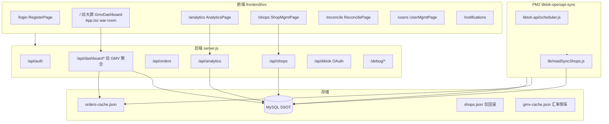
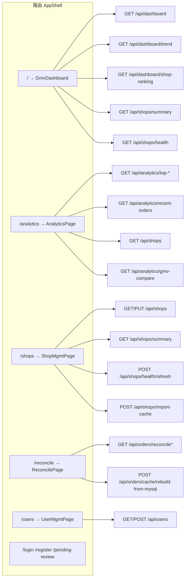
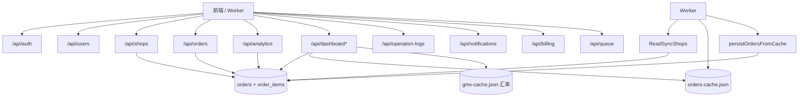

# 阶段一：全项目审计报告

> 生成目的：SaaS 数据中台模块化重构 — **不删除代码**，仅审计、标记、建目录边界。  
> 审计日期：2026-05-17

---

## 1. 当前系统结构图



**说明**：存在 **双 Dashboard 前端**（`/` 旧 war-room + `/analytics` 新分析页），后端 **双聚合入口**（`/api/dashboard*` + `/api/analytics/*`）。

---

## 2. 页面依赖图



| 页面 | 路径 | 数据源 | 状态 |
|------|------|--------|------|
| 旧 GMV 大屏 | `/` | `/api/dashboard*`（默认 MySQL，可切 cache） | **legacy 主入口** |
| 数据分析 | `/analytics` | `/api/analytics/*` + MySQL | **SaaS 主分析** |
| 店铺管理 | `/shops` | `/api/shops` MySQL | SaaS |
| 订单对账 | `/reconcile` | reconcile API + cache 对照 | SaaS/运维 |
| 用户管理 | `/users` | `/api/users` | SaaS |
| 登录/注册 | `/login` 等 | `/api/auth` | SaaS |
| **同步中心** | *未实现* | — | **待建 SyncCenter** |
| **授权明细** | *未独立页* | OAuth + shops 字段 | **待建 Authorizations** |
| **订单中心** | *未独立页* | 嵌在 analytics/旧大屏 | **待建 Orders** |

---

## 3. API 依赖图



---

## 4. 数据流图（目标 vs 现状）

```mermaid
flowchart LR
  TikTok[TikTok OpenAPI]
  TikTok --> Worker[openapi-sync worker]
  Worker -->|写| MySQL[(MySQL orders/shops)]
  Worker -->|合并| Cache[orders-cache.json]

  MySQL -->|DASHBOARD_DATA_SOURCE=mysql| DashAPI[/api/dashboard]
  MySQL --> AnaAPI[/api/analytics]
  Cache -->|fallback only| DashAPI

  DashAPI --> LegacyUI[旧大屏 /]
  AnaAPI --> NewUI[/analytics]

  ShopsJSON[shops.json] -.->|OPENAPI_SHOPS_SOURCE=json 回滚| Worker
```

**原则（已部分落地）**：`readSyncShops.js` + `OPENAPI_SHOPS_SOURCE=mysql`；`DASHBOARD_DATA_SOURCE=mysql` 默认。

---

## 5. 扫描结果分类

### 5.1 旧大屏页面

| 项 | 路径 | 处理建议 |
|----|------|----------|
| 旧 war-room 大屏 | `frontend/src/App.tsx` → `GmvDashboard`（约 792–2200 行） | **legacy**：保留样式参考；从主菜单引导至 `/analytics`；标记 `@deprecated` |
| 新分析页 | `frontend/src/AnalyticsPage.tsx` | **保留**：SaaS Dashboard 候选主入口 |
| 重复组件 | `frontend/src/RealtimeOrdersPanel.tsx`（re-export） | **可删**（仅转发到 components/） |

### 5.2 旧缓存订单逻辑

| 项 | 路径 | 引用方 | 处理建议 |
|----|------|--------|----------|
| orders-cache 读写 | `backend/tiktok-api/scheduler.js` | worker 合并写盘 | **保留**：cache/reconcile 专用 |
| 聚合引擎 | `backend/tiktok-api/ordersDashboardFromCache.js` | server dashboard、compare | **保留**：transform 层；非主读源 |
| rebuild | `backend/modules/orders/orderCacheRebuildService.js` | `/api/orders/cache/rebuild` | **保留** |
| reconcile | `backend/modules/orders/orderReconcileService.js` | ReconcilePage | **保留** |
| 主读切换 | `mysqlDashboardOrdersService.isMysqlPrimaryDashboard()` | server.js | **保留**：env 控制 |

### 5.3 旧 JSON 数据源

| 文件 | 用途 | 处理建议 |
|------|------|----------|
| `backend/storage/shops.json` | 历史 token/店铺 | **legacy/archive**；worker 默认不读 |
| `backend/storage.local.bak/shops.json` | 备份 | **archive** |
| `backend/storage/orders-cache.json` | worker 缓存 | **cache only** |
| `backend/storage/gmv-cache.json` | 汇率侧车 | **临时兼容**；后续 settings/DB |
| `backend/tiktok-api/shops.js` | readShops/writeShops | **deprecated**；OAuth/debug 仍用 |

### 5.4 mock 数据

| 项 | 路径 | 引用 | 处理建议 |
|----|------|------|----------|
| mock 数据源 | `backend/dataSources/mock.js` | **无任何 require** | **可删除** |
| index | `backend/dataSources/index.js` | 仅 export mock | **可删除** |
| UI 文案 | `App.tsx` ranking-mock-hint | 展示用 | 改文案或移除 |

### 5.5 旧同步脚本

| 脚本 | 作用 | 处理建议 |
|------|------|----------|
| `tiktokOpenApiSyncWorker.js` | PM2 入口 | **保留** |
| `migrate-shops-json-to-mysql.js` | 一次性导入 | **保留** → 合并为 importLegacyShopsJson |
| `importCaveraFromShopsJson.js` | 单店导入 | **保留** |
| `auditSyncShops.js` / `auditBrokenOrders.js` | 审计 | **保留** |
| `repairOrderShopMapping.js` | 修复 shop_id | **保留** |
| `rebuildOrdersCacheFromMysql.js` | 重建 cache | **保留** |
| `investigateCaveraShop.js` 等 | 排查 | **保留**（tools） |

### 5.6 前端读本地文件

| 项 | 说明 | 处理建议 |
|----|------|----------|
| localStorage | auth token、语言、币种、时间范围 | **保留**（UI 偏好，非业务数据） |
| 无 fs 读 JSON | 前端不直接读 orders-cache | 合规 |

### 5.7 硬编码店铺 / 市场

| 项 | 位置 | 处理建议 |
|----|------|----------|
| `PREFERRED_SHOP_NAME = 'CQ Chic Jewelry'` | `tiktok-api/shops.js` pickDashboardShop | **deprecated**；debug 专用 |
| `MARKET_FILTER_CODES` TH/PH/MY/SG/VN | `App.tsx` | **保留**；可改 API 下发 |
| Cavera 优先排序 | `readSyncShops.js` | **临时**；验收后可删 |

### 5.8 无用 / 低风险页面组件

| 项 | 建议 |
|----|------|
| `PendingReviewPage` | 保留（注册流） |
| `NotificationsPage` | 保留（超管） |
| `GmvCompareTrendPanel` | 保留（analytics 子功能） |

### 5.9 无用 API（评估）

| 路径 | 建议 |
|------|------|
| `/debug/*`、`/api/tiktok/debug-*` | **legacy**：生产禁用或鉴权 |
| `/api/dashboard/*` | **deprecated 聚合**：迁移完成后仅保留兼容层 |
| `dataSources/*` | **可删** |

### 5.10 server.js 巨石

| 项 | 行数级 | 建议 |
|----|--------|------|
| `backend/server.js` | OAuth + dashboard + static | **风险**：逐步迁入 `modules/dashboard`、`modules/sync` |

---

## 6. 可删除清单（确认无引用后执行）

| 路径 | 理由 |
|------|------|
| `backend/dataSources/mock.js` | 零引用 |
| `backend/dataSources/index.js` | 零引用 |
| `frontend/src/RealtimeOrdersPanel.tsx` | 仅 re-export `components/RealtimeOrdersPanel` |

**暂不删除**（虽有 legacy 标记但仍有引用）：`shops.json`、`orders-cache.json`、`gmv-cache.json`、`App.tsx` GmvDashboard。

---

## 7. 可移动 legacy 清单

| 现路径 | 建议 legacy 位置 | 说明 |
|--------|------------------|------|
| `App.tsx` 内 `GmvDashboard` | `legacy/old-dashboard/GmvDashboard.tsx`（未来抽离） | 第二步后抽，不一次改 |
| `backend/storage.local.bak/` | `legacy/old-json/` | 仅归档 |
| `backend/dataSources/` | `legacy/old-mock/` | 删除前可先移动 |
| `backend/tiktok-api/shops.js` 中 pickDashboardShop | 文档标记 | 逻辑仍被 OAuth 使用 |

---

## 8. 当前仍被引用（禁止贸然删）

| 类别 | 文件/能力 |
|------|-----------|
| Worker | `scheduler.js`, `readSyncShops.js`, `orderPersistenceService.js` |
| Dashboard API | `server.js` `/api/dashboard*`, `ordersDashboardFromCache.js` |
| SaaS 页面 | `AnalyticsPage`, `ShopMgmtPage`, `UserMgmtPage`, `ReconcilePage` |
| OAuth | `server.js` tiktok 路由, `tiktok-api/auth.js`, `oauthMysqlPersist.js` |
| 权限 | `middlewares/*`, `lib/userScope.js`, `dashboardShopGate.js` |
| 店铺 JSON 回滚 | `OPENAPI_SHOPS_SOURCE=json` → `tiktok-api/shops.js` |

---

## 9. 风险清单

| 风险 | 说明 | 缓解 |
|------|------|------|
| R1 双 Dashboard | `/` 与 `/analytics` 数据口径可能不一致 | 统一读 MySQL + 同一时间表达式 |
| R2 server.js 巨石 | 改 dashboard 易牵动 OAuth | 按模块拆路由 |
| R3 cache fallback | `DASHBOARD_DATA_SOURCE=cache` 仍可用 | staging 固定 mysql |
| R4 shop_id 历史脏数据 | platform_id 写入 shop_id | 跑 `repairOrderShopMapping.js` |
| R5 无 SyncCenter 页 | 无法 UI 排查同步 | 阶段七新建 |
| R6 roles 无独立表 | 权限在 user_tenants.role | 文档化，后续可建 roles 表 |
| R7 import-cache 仍暴露 | ShopMgmt 可从 cache 导入店 | 标记 deprecated，引导 OAuth |
| R8 App.tsx 体积 | 单文件 2200+ 行 | 渐进抽离到 pages/ |

---

## 10. 数据库模型确认（第三步）

| 任务书表名 | 现状 | 完整度 |
|------------|------|--------|
| users | `users` + `user_tenants` | 完整 |
| roles | **无独立表**；`user_tenants.role` 字符串 | 够用，可扩展 |
| shops | `shops` | 完整 |
| authorizations | **`shop_auth_tokens`**（非 authorizations 表） | 功能完整，命名不同 |
| orders | `orders` + `order_items` | 完整；`platform_shop_id` 列见 migrateOrders30 |
| sync_logs | **`sync_jobs` 粗粒度**；无 per-shop sync_logs | **缺失**，需阶段七补表 |
| operation_logs | `operation_logs` | 完整 |
| tenants | `tenants` | 完整 |

**仍依赖 cache/JSON 的页面/接口**：

| 消费方 | 依赖 | 主数据 |
|--------|------|--------|
| `/` GmvDashboard | `/api/dashboard` | 默认 MySQL；meta 仍暴露 cache 信息 |
| `/reconcile` | cache vs MySQL diff | 故意双源 |
| ShopMgmt `import-cache` | gmv-cache / orders-cache | **临时** |
| worker | 写 cache + MySQL | MySQL SSOT |
| `analyticsCompareService` | gmv-cache 汇率 | 侧车 |

---

## 11. 模块目录（第二步 — 已建边界说明）

实际代码在 `backend/modules/`（非 `backend/src/modules/`）。见：

- `backend/modules/README.md`
- `frontend/src/pages/README.md`
- `docs/database-map.md`、`docs/api-map.md`、`docs/deprecated-list.md`

**未新建业务重写**；仅 README + legacy 占位。

---

## 12. 下一阶段建议（严格顺序）

1. **阶段四 店铺**：确认平台管理员全量店铺 + 分页（`shops/service.js` tenant scope）。
2. **阶段五 授权**：新建 `Authorizations` 页，读 `shop_auth_tokens` + `shops.auth_status`。
3. **阶段六 订单**：新建 `Orders` 页，读 `/api/orders`（扩展列表 API 若缺）。
4. **阶段七 同步**：新建 `sync` 模块 + `sync_shop_logs` 表 + `SyncCenter` 页。
5. **阶段八 Dashboard**：`/analytics` 升为默认首页；`/` redirect；旧 GmvDashboard 移 legacy。
6. **阶段九 权限**：收口所有 API tenant/shop scope。
7. **阶段十 清理**：执行「可删除清单」、抽离 App.tsx。

---

## 13. 环境变量（SSOT 开关）

```env
DASHBOARD_DATA_SOURCE=mysql          # 禁止生产用 cache
OPENAPI_SHOPS_SOURCE=mysql           # 禁止生产用 json
```
