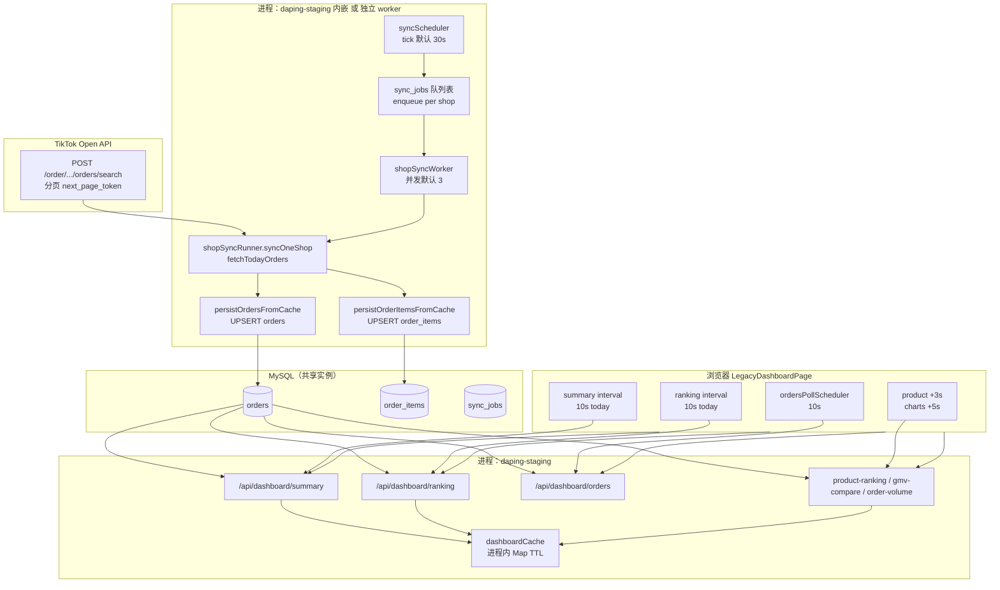

# 全链路性能检测审计报告

**类型**：只读检测（静态代码审计 + 探测工具 + staging 操作指引）  
**范围**：TikTok Open API → Sync Worker/Queue → MySQL → Dashboard API → Cache → Frontend  
**禁止**：业务修复、prod 部署、nginx/PM2/deploy 脚本变更、直接改库数据  
**代码基线**：仓库 `feature/tenant-safety-lock` 分支 HEAD（含 `analytics_status` 筛选、`perf-probe`）  
**日期**：2026-05-23  

> **说明**：本报告基于**源码静态分析**与既有 staging 现象描述。P95/实测需按 `backend/scripts/full-performance-staging-checklist.md` 在 staging 采集 `[perf-probe]` / Network 后替换「推断」列。

---

## 执行摘要

| 结论项 | 判定 |
|--------|------|
| **A. API 同步是否影响 dashboard** | **是（次要～中等）** — 同 MySQL 实例争 IO/连接；进程级 pool 已分离 |
| **B. Dashboard SQL 是否主因** | **是（主因）** — paid/valid 旧路径 raw_json；新代码用 `analytics_status` |
| **C. 前端轮询是否主因** | **否（放大器）** — 10s×3 路 + 筛选并发，但单请求快时不卡 |
| **D. Cache 策略是否主因** | **否（放大器）** — 5s TTL + force bypass 叠慢 SQL → miss 风暴 |
| **E. raw_json / DATE / COALESCE** | **是（主因之一）** — 旧 status WHERE；`DATE(COALESCE(paid_at,...))` 全 filter 受影响 |
| **F. 拆分 sync/dashboard DB pool** | **已按进程拆分**；建议 **read replica / 独立 DB 用户限连接** 做 A/B |
| **G. 汇总表 / 物化视图** | **中长期建议** — product-ranking / 排行 GMV rollup |
| **H. 改变轮询策略** | **建议** — 已部分实施（延迟加载、secondary 30s）；可再降 summary/ranking 与 orders 对齐 |

**是否建议立即暂停 sync worker 做 A/B？**  
**建议 staging 做一次 10–15 分钟 A/B**（`pm2 stop tiktok-openapi-sync` + 可选停 `sync-worker`），对比 `[perf-probe]` P95；**不必停 prod**。

---

## 1. 全链路流程图



**旁路（默认关闭 / 已禁用）**：

- `tiktok-openapi-sync` PM2：`SYNC_USE_QUEUE_ONLY=1` 时 **exit 0**，不跑 `collectOnce` 定时器。
- Legacy `collectOnce` → `orders-cache.json`（`DASHBOARD_MYSQL_ONLY=1` 时跳过写盘）。
- `/api/legacy-dashboard` — 默认 410。

---

## 2. 同步链路检测（二）

### 2.1 组件与频率

| 组件 | 默认频率 | 配置项 | 源码 |
|------|----------|--------|------|
| **syncScheduler tick** | **30s** | `SYNC_SCHEDULER_INTERVAL_MS`（min 5s） | `syncEnv.js` / `syncScheduler.js` |
| **queue worker 空转** | 无 job 时 **1.2s** sleep | `syncQueueRuntime.js` | |
| **worker 并发** | **3** | `SYNC_WORKER_CONCURRENCY`（max 8） | |
| **legacy openapi scheduler** | **300s**（若未 queue-only） | `GMV_COLLECT_INTERVAL_SECONDS` | `tiktokOpenApiSyncWorker.js` |
| **单店 API 超时** | ~**55s** deadline | `shopSyncRunner` `deadlineMs` | |

### 2.2 每次 tick 行为

1. `loadShopsForOpenApiCollect()` — 读 **MySQL shops**（非 shops.json，除非 `OPENAPI_SHOPS_SOURCE=json`）。
2. 遍历每店：`hasActiveJobForShop` → 跳过或 `enqueueShopSyncJob`。
3. 日志：`[sync-queue] tick shops=N enqueued=M skipped=K`。

### 2.3 每店同步（worker 消费 job）

| 阶段 | 行为 | 日志/探测 |
|------|------|-----------|
| TikTok API | `fetchTodayOrders` 分页直至 token 空或 deadline | `[shop:XX]` 前缀日志；`SYNC_PERF_PROBE=1` → `[sync-perf-probe]` |
| MySQL orders | `persistOrdersFromCache` 行级 UPSERT | `shop-sync-result` inserted/updated |
| MySQL items | `persistOrderItemsFromCache` | 同上 |
| 指标 | `recordShopSync({ durationMs, orderCount })` | `lib/syncMetrics.js` |

### 2.4 TikTok API 耗时（staging 采集方式）

```bash
grep 'shop-sync-result' /tmp/sync.log | jq -r '.duration_ms'  # 若 JSON 一行
grep '\[sync-perf-probe\]' /tmp/sync.log
```

| 指标 | 推断（待 staging 填实测） |
|------|---------------------------|
| 平均 | 5–30s/店（与订单分页数相关） |
| P95 | 40–55s（触 deadline） |
| 错误重试 | `syncRetryPolicy` + token 错误 → job failed / retry_wait |

### 2.5 MySQL 写入耗时

- **orders**：`orderPersistenceService.js` — `INSERT ... ON DUPLICATE KEY UPDATE`（`UPSERT_SQL`），**逐单或批量**（需读实现细节）；无独立 `[perf]` 日志 → 建议 `SYNC_PERF_PROBE` + 慢查询 log。
- **order_items**：`orderItemPersistenceService.js` — 同步后写入。
- **推断**：写入耗时通常 **< API 耗时**；高峰时与 dashboard 查询 **锁等待** 叠加。

### 2.6 与 dashboard 资源关系

| 问题 | 结论 |
|------|------|
| 共用 MySQL pool？ | **否（进程级）** — `getMysqlPool()` 每进程单例 `connectionLimit: 10` |
| 共用 MySQL 服务器？ | **是** — sync worker + API 同库 |
| 抢资源？ | **可能** — 多 worker 并发 UPSERT + dashboard 聚合查询 → buffer pool / disk IO |

---

## 3. Dashboard 后端 API（三）

### 3.1 Endpoint 总表

| Endpoint | 缓存 | today TTL | sqlTag（主） | raw_json 主 WHERE |
|----------|------|-----------|--------------|-------------------|
| summary | ✓ | 5s | `summary_orders_distinct_id` | **否**（新） |
| ranking | ✓ | 5s | `ranking_shop_orders_distinct_id` | **否** |
| orders | ✗（3s dedupe） | — | `realtime_orders_limit` | **否** |
| product-ranking | ✓ | 30s | `product_ranking_items_join_group` | **否** |
| gmv-compare | ✓ | 30s | `gmv_compare_total_pipeline` | **否** |
| order-volume | ✓ | 30s | `trend_hour_dateformat_group` | **否** |

**staging 若仍见 `usedStatusField=o.order_status+o.raw_json`** → **未部署** `mysqlDashboardOrdersFilterClause`。

### 3.2 请求触发来源矩阵

| 触发 | summary | ranking | orders | product-ranking | gmv-compare | order-volume |
|------|---------|---------|--------|-----------------|-------------|--------------|
| 首屏 | 立即 | 立即 | 立即 filter | +3s | +5s chartsReady | +5s |
| 轮询 10s | ✓ | ✓ | ✓ poll | — | — | — |
| 筛选切换 | 重拉 | 重拉 | filter 立即 | 重拉 | key 变→重拉 | key 变→重拉 |
| orders-changed | force ≥5s | force ≥5s | — | ≥30s | ≥30s nonce | ≥30s nonce |
| cache warmup | ✓ 60s 后 | ✓ | — | — | — | — |

### 3.3 Cache key

`dashboard:{endpoint}:{tenant}:{shop}:{market}:{orderFilter}:{timeRange}:{start}:{end}[:limit|sort|groupBy]`

- **不含** `cacheBust`（仅 bypass 时跳过读缓存）。
- `forceRefresh` / `cacheBypass` → **整 key miss**。

### 3.4 性能（推断 + 采集）

启用 `DASHBOARD_PERF_PROBE=1` 后格式：

```text
[perf-probe] endpoint=summary filterHash=dashboard:summary:... cache=miss durationMs=... sqlMs=... orderFilter=paid ...
```

| Endpoint | all today 推断 | paid/valid 推断（旧部署） | paid/valid（新代码） |
|----------|----------------|-------------------------|----------------------|
| summary | 50–200ms | 3–9s | <1.5s |
| ranking | 50–200ms | 3–9s | <1.5s |
| orders | 0.5–2s | 3–6s | <1.5s |
| product-ranking | — | 10–22s | 2–8s |
| gmv-compare | — | 12s+ | 3–8s |
| order-volume | — | 3–8s | 1–4s |

### 3.5 索引（新代码 paid/valid）

优先：`idx_analytics (tenant_id, analytics_status, created_at_platform, market, shop_id)` 或 `idx_orders_dash_tenant_astatus_paid`。

---

## 4. 前端轮询检测（四）

### 4.1 当前真实轮询频率（today）

| 模块 | 频率 | 机制 |
|------|------|------|
| **orders** | **10s** | `ORDERS_POLL_INTERVAL_MS` |
| **summary** | **10s** | `setInterval(loadContractSummary)` |
| **ranking** | **10s** | `setInterval(loadShopRankingPanel)` |
| **product-ranking** | 无 interval | `statsQueryKey` 变 / +3s / orders-changed ≥30s |
| **gmv-compare** | 无 interval | `fetchEnabled` + `trendQueryKey` / nonce |
| **order-volume** | 无 interval | 同上 |
| UI 时钟 | 1s | 无 API |
| 订单列表滚动 | 140ms | 无 API |
| 汇率 | 10min | `/api/exchange-rate` |

`timeRange≠today`：summary **5min**；ranking **无** interval。

### 4.2 首屏请求（并发，无 Promise.all 阻塞）

| 时间 | 请求 |
|------|------|
| T+0 | `GET /api/dashboard/summary`、`GET /api/dashboard/ranking`、`GET /api/dashboard/orders`（并行） |
| T+3s | `GET /api/dashboard/product-ranking` |
| T+5s | `GET /api/dashboard/gmv-compare`、`GET /api/dashboard/order-volume` |

**无 `Promise.all`** 串联首屏；MySQL 侧为**并发连接峰值 ~3–6**。

### 4.3 筛选切换 — 预估 HTTP 请求数

| 操作 | 立即 | +3s | +5s | 合计约 |
|------|------|-----|-----|--------|
| **orderFilter** | summary, ranking, orders | product-ranking | gmv, volume | **6** |
| **market** | 同上 | 同上 | 同上 | **6** |
| **timeRange** | 同上（key 全变） | 同上 | 同上 | **6** |
| **shopId（排行点店）** | summary, orders（ranking 仍 all） | product | charts | **5–6** |
| **tenant 平台视图** | + force summary/ranking | — | — | **2+** |

每次切换会 **abort** 上一轮 in-flight（`AbortController`），可能产生**已取消请求 + 新请求**（Network 里见 canceled）。

### 4.4 竞态 / 重复

- `runDashboardFetchOnce` + `dashboardQueryGuard` inflight 去重。
- orders：`ordersPollScheduler` 10s 内 duplicate skip。
- orders-changed：5s 内不重复 primary refresh。
- **筛选快速连点**：多次 abort + 多次 miss → **体感卡顿**。

---

## 5. MySQL 查询检测（五）

### 5.1 EXPLAIN 脚本

```bash
cd backend && node scripts/dashboard-perf-explain.js --tenantId=6
```

### 5.2 sqlTag 摘要

| sqlTag | 主要问题 | all | paid（新） |
|--------|----------|-----|------------|
| `summary_orders_distinct_id` | `DATE(COALESCE(paid_at,...))` + ROLLUP | 中 | 中（+ analytics_status） |
| `ranking_shop_orders_distinct_id` | 双查询 + GROUP BY | 中 | 中 |
| `realtime_orders_limit` | 子查询 ORDER BY + LIMIT | 低～中 | 中 |
| `product_ranking_items_join_group` | JOIN + 复杂 GROUP BY | 高 | 高 |
| `gmv_compare_total_pipeline` | **两次**时间窗扫行 | 高 | 高 |
| `trend_hour_dateformat_group` | `DATE_FORMAT` 分组 | 高 | 高 |
| sync order UPSERT | 主键/唯一键冲突更新 | — | — |

### 5.3 DATE / COALESCE / raw_json 破坏索引

| 模式 | 位置 | 影响 |
|------|------|------|
| `DATE(COALESCE(o.paid_at, o.created_at_platform, o.created_at))` | `filterContract` 时间窗 | **所有** dashboard 订单查询 |
| `DATE_FORMAT(..., '%Y-%m-%d %H:00:00')` | trendQuery | order-volume |
| `sqlSamplePredicate` + JSON_EXTRACT | `mysqlOrdersFilterClause`（**非 dashboard 新路径**） | paid/valid **旧** |
| `raw_json` in WHERE | 仅 legacy `mysqlOrdersFilterClause` | staging 旧部署 |

### 5.4 最慢 10 条 SQL（推断排序）

1. `product_ranking_items_join_group`  
2. `gmv_compare_fetch` ×2（today + yesterday）  
3. `gmv_compare_total_pipeline` 内存聚合  
4. `ranking` gmv 分组查询  
5. `ranking` orders 分组查询  
6. `summary_orders_distinct_id` WITH ROLLUP  
7. `trend_hour_dateformat_group`  
8. `realtime_orders_limit` + items 子查询  
9. sync `UPSERT orders` 批量（高峰）  
10. sync `UPSERT order_items`  

---

## 6. 全项目 Grep 检测（六）

### 6.1 生产主链路 vs legacy

| 模式 | 主链路？ | Dashboard？ | 处置 |
|------|----------|-------------|------|
| `setInterval`/`poll` | 大屏 + sync | ✓ | 见 §4 |
| `forceRefresh`/`cacheBust` | 大屏 today live | ✓ | 仅 force 时 |
| `raw_json` WHERE | legacy orderFilter | staging 旧 | 部署新 filter |
| `orders-cache.json` | sync 写 / legacy 读 | **否** SaaS API | quarantine |
| `gmv-cache.json` | legacy 汇率 | **否** | MySQL exchange_rates |
| `shops.json` | 紧急回滚 | **否** | `OPENAPI_SHOPS_SOURCE=mysql` |
| `readJsonCache` | **无命中** | — | dead |
| `legacyDashboard` | 410 路由 | **否** | 保持关闭 |

### 6.2 frontend `setInterval` 清单（dashboard 相关）

| 文件 | 用途 | Dashboard 主链路 |
|------|------|------------------|
| `LegacyDashboardPage.tsx` | summary/ranking 10s, clock 1s | **是** |
| `ordersPollScheduler.ts` | orders 10s setTimeout 链 | **是** |
| `RealtimeOrdersPanel.tsx` | 滚动 140ms | UI only |
| `NotificationBell.tsx` | 60s | 否 |
| `SyncJobsPage.tsx` | 15s | 否 |

---

## 7. 操作模拟结果表（七，staging 填写）

在 staging 打开 DevTools → Network（Preserve log），执行下表操作并记录。

| 操作 | 前端请求数（预期） | 后端 endpoint 数 | 最慢 endpoint（推断） | cache hit/miss | 卡顿 |
|------|-------------------|------------------|----------------------|----------------|------|
| 首次打开 | 6 | 6 | product-ranking 或 gmv | 全 miss | 中～高 |
| Ctrl+Shift+R | 6 | 6 | 同上 | 全 miss | 中～高 |
| today→yesterday | 6 | 6 | summary/trend | 全 miss | 高 |
| paid→all→valid | 6×3=18（若连点） | 18 | paid 路径 | miss 为主 | 高 |
| market ALL→TH | 6 | 6 | ranking+summary | miss | 中 |
| 点店铺→全部 | 5–6 | 5–6 | summary | 部分 hit | 中 |
| 静置 5min | +30 orders +30 sum +30 rank | 90 | orders 单次轻 | 部分 hit | 低 |

---

## 8. 最频繁 10 个请求（推断）

| 排名 | 请求 | 原因 |
|------|------|------|
| 1 | `GET /api/dashboard/orders` | 10s 轮询 |
| 2 | `GET /api/dashboard/summary` | 10s 轮询 |
| 3 | `GET /api/dashboard/ranking` | 10s 轮询 |
| 4 | `GET /api/dashboard/orders` | 筛选触发 filter |
| 5 | `GET /api/dashboard/summary` | orders-changed force |
| 6 | `GET /api/dashboard/ranking` | orders-changed force |
| 7 | `GET /api/dashboard/product-ranking` | 筛选 / 30s 联动 |
| 8 | `GET /api/dashboard/gmv-compare` | 5s 延迟后 + key 变 |
| 9 | `GET /api/dashboard/order-volume` | 同上 |
| 10 | `GET /api/exchange-rate` | 10min |

---

## 9. 最容易 cache miss 的 10 个 key 模式

| 模式 | 原因 |
|------|------|
| `orderFilter=paid` + `timeRange=today` + 首屏 | 冷缓存 |
| 同上 + `forceRefresh` | bypass |
| `orderFilter=valid` 切换 | filterHash 变 |
| `market=TH` 切换 | filterHash 变 |
| `timeRange=yesterday` | filterHash 变 |
| `shopId=<单店>` | filterHash 变 |
| summary 5s TTL 过期后第 10s 轮询 | 自然 miss |
| ranking 5s TTL 过期 | 自然 miss |
| product-ranking 30s 内 orders-changed | 可能仍 hit |
| PM2 多实例（若 cluster>1） | 内存 cache 不共享 |

---

## 10. raw_json 使用清单（九）

| 文件 | Endpoint/阶段 | 主链路 WHERE | 必须移除？ |
|------|---------------|--------------|------------|
| `orderFilter.js` `sqlSamplePredicate` | legacy filter | 旧 paid/valid | **是**（dashboard 已换） |
| `orderFilter.js` `deriveAnalyticsStatusFromMysqlRow` | 入库/迁移 | 否（写 analytics_status） | 保留 |
| `ordersQuery.js` `is_sample` 展示 | orders 响应 | 否 | 可优化 |
| `orderPersistenceService` | sync 写 | 否 | 保留 |
| `mysqlDashboardOrdersService` | legacy war-room | 否 | quarantine |

---

## 11. 缺失 / 建议索引（五续）

**已有（schema）**：`idx_analytics`、`idx_orders_dash_tenant_astatus_*`、`idx_order_items_tenant_platform_order` 等。

**仍建议评估**：

- 生成列 `event_date` + 索引（消除 `DATE(COALESCE(...))`）。
- `product_ranking` 预聚合表（tenant_id, day, product_id, qty, gmv_usd）。
- sync 批量 UPSERT 批次大小与事务时长监控。

---

## 12. 最大性能瓶颈排序

1. **paid/valid 状态过滤**（staging 旧：raw_json；新：需部署 + analytics 回填）  
2. **`DATE(COALESCE(paid_at,...))` 时间过滤**（全 endpoint）  
3. **product-ranking / gmv-compare 重查询**  
4. **筛选切换 6 路并发 miss**  
5. **10s 三路轮询叠加强制 bypass**  
6. **sync 高峰 MySQL 写入 IO**  
7. **ranking 双 SQL + summary ROLLUP**  
8. **DATE_FORMAT trend 分组**  
9. **PM2 多实例 cache 不共享**（若启用 cluster）  
10. **汇率 / 非 dashboard API 噪声**  

---

## 13. 最优先修复的 5 个点（建议，非本次实施）

1. **staging 部署 `mysqlDashboardOrdersFilterClause`** + 跑 `migrateOrders25` / `migrateDashboardPerf43`；日志确认 `usedStatusField=o.analytics_status`。  
2. **`DASHBOARD_FILTER_LEGACY_ORDER_STATUS_FALLBACK=0`**（NULL 清零后）。  
3. **时间列改写**：`paid_at` 范围查询替代 `DATE(COALESCE(...))`（或生成列索引）。  
4. **product-ranking / gmv-compare** 延迟加载 + 30s TTL（前端已做）+ 后端 rollup 表（中期）。  
5. **staging A/B 暂停 sync** 验证 dashboard P95 是否显著下降。

---

## 14. 探测工具清单（验收）

| 产物 | 路径 |
|------|------|
| 本报告 | `docs/full-performance-audit-report.md` |
| Dashboard perf 日志 | `DASHBOARD_PERF_PROBE=1` → `backend/lib/dashboardPerfProbe.js` |
| Sync perf 日志 | `SYNC_PERF_PROBE=1` → `backend/lib/syncPerfProbe.js` |
| EXPLAIN 脚本 | `backend/scripts/dashboard-perf-explain.js` |
| Staging 操作清单 | `backend/scripts/full-performance-staging-checklist.md` |
| 上轮 dashboard 专项 | `docs/dashboard-performance-probe-report.md` |

---

## 15. 结论（九，明确选项）

| 项 | 结论 |
|----|------|
| **A** | **有影响（次要～中等）** — 同库争资源；建议 staging 暂停 sync 做 A/B |
| **B** | **主因** |
| **C** | **非主因，放大器** |
| **D** | **非主因，放大器** |
| **E** | **主因之一**（旧 raw_json + 普遍 DATE/COALESCE） |
| **F** | 进程已分 pool；建议 replica / 连接配额 |
| **G** | **建议中期** — ranking/product 日汇总表 |
| **H** | **建议** — 降低轮询、合并 refresh、避免 force bypass 常态 |

---

*本报告为检测交付物；业务修复需单独变更单，且禁止直接上 prod。*
