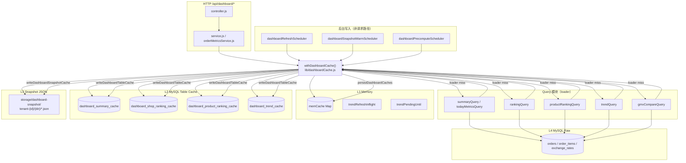
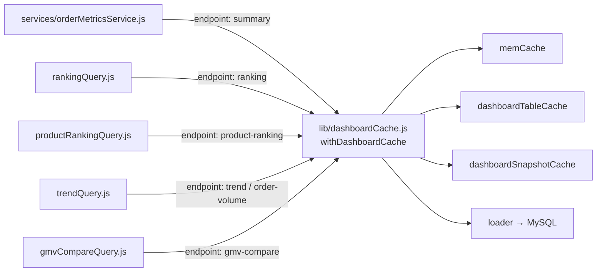

# P1-C.2 Dashboard 缓存体系审计

> **任务**：P1-C.2（只读审计）  
> **审计日期**：2026-05-29  
> **版本点**：`daping-staging-P1C-cache-audit`（须在 git 仓库根目录打 tag）  
> **纪律**：未改 PROD / UI / 接口返回 / 业务逻辑；仅新增本文档。

**关联文档**：[`p1c-data-source-audit.md`](./p1c-data-source-audit.md)、[`data-source-policy.md`](./data-source-policy.md)

---

## 1. 执行摘要

Dashboard 读路径由 **`lib/dashboardCache.js` → `withDashboardCache()`** 统一编排，事实源始终是 **MySQL `orders` 聚合 loader**；缓存仅为加速。

| 层级 | 实现 | 作用 |
|------|------|------|
| **L1 Memory** | `dashboardCache.memCache`（进程内 `Map`） | 最热 key 亚秒级命中 |
| **L2 MySQL Table** | `dashboard_*_cache` 四张表 | 跨请求/重启可复用（同进程 miss 后读表） |
| **L3 Snapshot JSON** | `storage/dashboard-snapshot/` | 仅 5 类 endpoint；staging 可开、prod 默认关 |
| **L4 MySQL Raw** | `todayMetricsQuery` / `*Query.js` loader | cache 全 miss 时同步执行 SQL |

**推荐统一方案（见 §7）**：**方案 A — memory + MySQL table cache**；**逐步淘汰 L3 snapshot 文件层**（与 table 重复，且增加筛选切换时的 near-expiry/stale 行为复杂度）。

---

## 2. 缓存架构图

### 2.1 总览



### 2.2 `withDashboardCache` 调用关系图



| 调用方文件 | `endpoint` 参数 | 对外 API |
|------------|-----------------|----------|
| `orderMetricsService.getTodayOrderSummary` | `summary` | `GET /api/dashboard/summary` |
| `rankingQuery.queryDashboardRanking` | `ranking` | `GET /api/dashboard/ranking` |
| `productRankingQuery.queryDashboardProductRanking` | `product-ranking` | `GET /api/dashboard/product-ranking` |
| `trendQuery.queryDashboardTrend` | `trend` 或 `order-volume` | `GET /api/dashboard/trend`、`order-trend`、`order-volume` |
| `gmvCompareQuery.queryDashboardGmvCompare` | `gmv-compare` | `GET /api/dashboard/gmv-compare`、`gmv-trend` |

**未走 `withDashboardCache` 的 Dashboard 相关读**

| 路径 | 缓存 |
|------|------|
| `GET /api/dashboard/orders` | 仅 `dashboardRequestDedupe`（3s 去重），直查 MySQL |
| `isDashboardApiReadonly()` 为真时 | `dashboardReadonlyCache.serveDashboardReadonly`（禁止 loader，只读 L1→L2→L3） |

---

## 3. `dashboard_*_cache` 表清单

定义见 `backend/db/schema.sql`（迁移 `migrateDashboardRollup44.js`）。

| 表名 | `ENDPOINT_TABLE` 键 | 承载 endpoint | 主要列 |
|------|---------------------|---------------|--------|
| `dashboard_summary_cache` | `summary` | summary | `tenant_id`, `cache_key`(sha256 rollup), `shop_id`, `market`, `order_filter`, `time_range`, `start_date`, `end_date`, `payload_json`, `refreshed_at`, `expires_at` |
| `dashboard_shop_ranking_cache` | `ranking` | ranking | 同上 |
| `dashboard_product_ranking_cache` | `product-ranking` | product-ranking | 同上 |
| `dashboard_trend_cache` | `trend`, `gmv-compare`, `order-volume` | 趋势类三端点 | 同上 + **`endpoint`** 列 |

**读**：`readDashboardTableCache` — `expires_at > NOW(3)`；趋势类可 `allowStale` + `readTrendTableStaleByDimensions`（按 shop/market/order_filter/time_range 维度兜底）。  
**写**：`writeDashboardTableCache` — loader 或 `persistDashboardCaches` 成功后 upsert。  
**开关**：`DASHBOARD_TABLE_CACHE_ENABLED`（默认 `1`）。

---

## 4. Snapshot 目录清单

**根目录**：`backend/storage/dashboard-snapshot/`（`SNAPSHOT_ROOT`）

| `endpoint`（代码键） | 子目录 `ENDPOINT_DIR` | 是否参与 snapshot |
|----------------------|----------------------|-------------------|
| `summary` | `summary` | ✅ |
| `ranking` | `shop-ranking` | ✅ |
| `product-ranking` | `product-ranking` | ✅ |
| `gmv-compare` | `gmv-compare` | ✅ |
| `order-volume` | `order-volume` | ✅ |
| **`trend`** | — | ❌ **无** snapshot 目录（仅 table + memory） |

**路径模式**

```text
storage/dashboard-snapshot/
  tenant-{tenantId}/
    {summary|shop-ranking|product-ranking|gmv-compare|order-volume}/
      {endpoint}_{timeRange}_{orderFilter}_{market}_{shopId}_{filterHash6}.json
```

- `filterHash6` = `sha256(cacheKey).slice(0,6)`，`cacheKey` 含 `market` / `orderFilter` / `timeRange` / `shopId` / 日期 / `extra`（如 `groupBy`、`sort`）。
- 信封字段：`version`, `expiresAt`, `source: mysql`, `data`（payload）。

**开关**

| 变量 | 行为 |
|------|------|
| `DASHBOARD_SNAPSHOT_CACHE_ENABLED` | 显式 `0` 关闭 |
| `APP_ENV=prod` 且未显式开启 | **默认关闭**（不改 prod .env） |
| 存储不可写 | 自动关闭 |

**后台写入**：`dashboardSnapshotWarmScheduler`、`persistDashboardCaches` / `warmDashboardSnapshot`（命中上层缓存时异步补写文件）。

---

## 5. Memory Cache 实现位置

| 位置 | 变量 | 用途 |
|------|------|------|
| `lib/dashboardCache.js` | `memCache` | **主 L1**：`cacheGet` / `cacheSet`，TTL 按 endpoint + `timeRange` |
| `lib/dashboardCache.js` | `trendRefreshInflight` | 趋势类 miss 后后台 refresh Promise 去重 |
| `lib/dashboardCache.js` | `trendPendingUntil` | 趋势 pending 占位最长 5s（`DASHBOARD_TREND_PENDING_MAX_MS`） |
| `lib/dashboardRequestDedupe.js` | `inFlight` | **`/api/dashboard/orders` 专用**，3s 去重（非 withDashboardCache） |
| `lib/dashboardReadonlyCache.js` | — | 只读模式：仅用传入的 `cacheGet`，不调 loader |
| `lib/dashboardSnapshotWarmScheduler.js` | `warmInflight`, `tenantCursor` | 预热任务并发/游标 |
| `lib/dashboardPrecomputeScheduler.js` | `scopeCursor` | 预计算调度游标 |
| `lib/dashboardPrecomputeCore.js` | `jobInflight` | 预计算任务去重 |
| `lib/dashboardReadonly.js` | `precomputeHints` | 预计算提示 |
| `lib/dashboardSlowCollector.js` | `buckets` | 慢查询统计（非业务 payload） |
| `modules/analytics/service.js` | 独立 `memCache` | **非 Dashboard 体系**（search-sku / status-debug） |

---

## 6. 各接口读路径与优先级

说明：

- **MySQL raw** = `loader()` 内对 `orders` 等表的实时聚合（`todayMetricsQuery`、`rankingQuery` loader 等）。
- **Snapshot** 仅当 `isSnapshotCacheEnabled()` 且 endpoint ∈ `SNAPSHOT_ENDPOINTS`。
- **Near-expiry**：命中后可能标 `*-stale` 并 **后台** `scheduleDashboardBackgroundRefresh`（不阻塞当前响应）。

### 6.1 `summary`

| 优先级 | 层级 | 条件 |
|--------|------|------|
| 1 | **Memory** | `cacheGet(cacheKey)` 命中且未 near-expiry |
| 1b | Memory + 后台 refresh | 命中但 near-expiry → 仍返回 memory，异步 refresh |
| 2 | **MySQL table** | `dashboard_summary_cache` 未过期 |
| 3 | **Snapshot** | fresh 文件 → 提升 memory；near-expiry → stale + 后台 refresh |
| 3b | Snapshot stale | 过期文件仍可读 → stale + 后台 refresh |
| 4 | **MySQL raw** | 全 miss → `loader` → `persistDashboardCaches`（写 L1+L2+L3） |

`cacheKey` 示例：`dashboard:summary:{tenant}:{shop}:{market}:{orderFilter}:{timeRange}:{start}:{end}`

### 6.2 `trend`（endpoint 名 `trend`）

| 优先级 | 层级 | 条件 |
|--------|------|------|
| 0 | Bypass | `cacheBypass` / `forceRefresh` → 直跑 loader + 写全层 |
| 1 | **Memory** | 命中；near-expiry → stale + 后台 refresh |
| 2 | **MySQL table** | `dashboard_trend_cache` fresh |
| 3 | **Snapshot** | ❌ **不适用**（`trend` 不在 `SNAPSHOT_ENDPOINTS`） |
| 4 | **MySQL table stale** | 同 key 过期行（`allowStale`） |
| 5 | **MySQL table dim-stale** | 同 tenant/shop/market/order_filter/time_range 最近一条（`readTrendTableStaleByDimensions`） |
| 6 | **Pending** | 启动后台 refresh + 返回 `buildTrendPendingPlaceholder`（**不阻塞 SQL**） |
| — | **MySQL raw** | 仅在 bypass 或后台 `scheduleDashboardBackgroundRefresh` 中执行 |

### 6.3 `ranking`

与 **summary** 相同（非趋势分支）：Memory → Table (`dashboard_shop_ranking_cache`) → Snapshot (`shop-ranking/`) → MySQL raw。

`extra` 含 `limit`, `sort`, `scope`（assigned shops）。

### 6.4 `product-ranking`

与 **ranking** 相同：Memory → `dashboard_product_ranking_cache` → Snapshot (`product-ranking/`) → loader。

`extra` 含 `limit`, `sort`（qty/gmv/orders）。

### 6.5 `order-volume`

与 **trend** 相同（`isTrendCacheEndpoint`）：Memory → Table → **Snapshot 有**（`order-volume/`）→ table stale → dim-stale → pending。

`extra` 含 `groupBy`（hour/day）。

### 6.6 对照总表

| 接口 endpoint | Memory | MySQL table | Snapshot JSON | MySQL raw（同步） |
|---------------|--------|-------------|---------------|-------------------|
| **summary** | ① | ② | ③ | ④ miss |
| **ranking** | ① | ② | ③ | ④ miss |
| **product-ranking** | ① | ② | ③ | ④ miss |
| **trend** | ① | ② | — | 仅 bypass / **后台** refresh |
| **order-volume** | ① | ② | ③（在 trend 分支内） | bypass / **后台** refresh |

---

## 7. 推荐统一方案

### 方案对比

| | **A. memory + MySQL table** | **B. MySQL table only** |
|---|---------------------------|-------------------------|
| 延迟 | 热 key 最优 | 每次多一次 DB 读 cache 表 |
| 多实例 | 各进程 memory 不一致，靠 table 对齐 | 一致性好 |
| 复杂度 | 中（现有已实现） | 低 |
| 与现网 | staging 已运行 A | 需删 L1 逻辑、回归性能 |

### 推荐：**方案 A（memory + MySQL table）+ 去掉 Snapshot 层**

理由：

1. **代码已按 A 实现**，summary/ranking/product-ranking 同步路径成熟；table 与 memory 通过 `persistDashboardCaches` / table hit 时 `cacheSet` 保持一致。
2. **L3 snapshot 与 L2 table 重复**：同一 `cacheKey` 双份 JSON，预热 scheduler 增加运维面；prod 已默认关 snapshot。
3. **水平扩展前**：单 staging 节点 A 足够；未来若多副本再引入 Redis 替代 memory，而不是加 snapshot 文件。
4. **方案 B** 可作为压测对照（`clearDashboardCache` + 仅 table），不建议作为默认架构。

**不建议保留 snapshot 作为统一栈一环**；staging 验收通过后可设 `DASHBOARD_SNAPSHOT_CACHE_ENABLED=0`，仅保留 memory + table + MySQL loader。

---

## 8. 筛选切换评估（市场 / 时间 / 订单状态）

### 8.1 Cache Key 是否隔离

`buildDashboardCacheKey` / `buildTrendDashboardCacheKey` 包含：

- `market`
- `orderFilter`（经 `contractForTrendKpiCache` 归一化，`paid`→`valid`）
- `timeRange`、`startDate`、`endDate`
- `shopId`
- `extra`（如 `groupBy`、`sort`、`limit`）

**结论**：切换市场、时间范围、订单状态 → **不同 cacheKey** → 不会直接命中「另一筛选条件」的 memory/table 行。

### 8.2 是否仍依赖 Snapshot

| 场景 | 依赖 snapshot？ |
|------|----------------|
| 切换 market / orderFilter / timeRange（summary、ranking、product-ranking） | **仅当** L1+L2 miss 且 `DASHBOARD_SNAPSHOT_CACHE_ENABLED=1` 时，才读 snapshot；否则直查 MySQL |
| 切换至已预热过的组合 | 可能命中 snapshot **或** table（预热写两者） |
| `trend` 切换筛选 | **不读** snapshot；可能 dim-stale 读 table 中「同维度、不同 extra」的旧行 |
| prod 默认 | snapshot **关闭** → **不依赖** |

### 8.3 风险点（与 snapshot 无关的行为）

1. **趋势 pending**：快速切换筛选时，可能短暂看到 placeholder（`cacheSource: pending`），后台 refresh 完成后下次命中 memory。
2. **dim-stale**（仅 trend/order-volume/gmv-compare）：精确 key miss 时，可能展示同 shop/market/order_filter/time_range 的**旧 groupBy/sort** 缓存（标 stale + 后台刷新）。
3. **Near-expiry**：任一层的 TTL 将尽时，先返回旧值再异步 refresh——切换筛选后若新 key 无缓存，仍走 miss 路径，不受旧 key near-expiry 影响。

**结论**：筛选切换的 correctness 由 **cacheKey 维度隔离** 保证；snapshot 不是必需，关闭后行为更简单、可预测。

---

## 9. 环境变量速查

| 变量 | 默认 | 作用 |
|------|------|------|
| `DASHBOARD_TABLE_CACHE_ENABLED` | `1` | L2 表缓存 |
| `DASHBOARD_SNAPSHOT_CACHE_ENABLED` | staging 随 table；prod 关 | L3 文件 |
| `DASHBOARD_CACHE_TTL_*_MS` | 见 `TTL_BOUNDS` | L1 TTL |
| `DASHBOARD_TREND_CACHE_TTL_MS` | 90s | trend 类 |
| `DASHBOARD_SNAPSHOT_WARMUP_ENABLED` | 可选 | 预热 worker |
| `DASHBOARD_API_READONLY` | — | 走 `dashboardReadonlyCache`，禁止同步 SQL |

---

## 10. 代码锚点

| 模块 | 路径 |
|------|------|
| 编排入口 | `backend/lib/dashboardCache.js` |
| 表缓存 | `backend/lib/dashboardTableCache.js` |
| 文件快照 | `backend/lib/dashboardSnapshotCache.js` |
| 趋势 key / paid 清理 | `backend/lib/dashboardTrendCache.js` |
| 只读 API 路径 | `backend/lib/dashboardReadonlyCache.js` |
| 统一 metrics 入口 | `backend/services/orderMetricsService.js` |

---

## 11. Build

```text
cd frontend && npm run build
✓ tsc -b && vite build（审计日通过）
```

---

## 12. 版本点

```bash
git tag -a daping-staging-P1C-cache-audit -m "P1-C.2 dashboard cache audit (docs only)"
```
